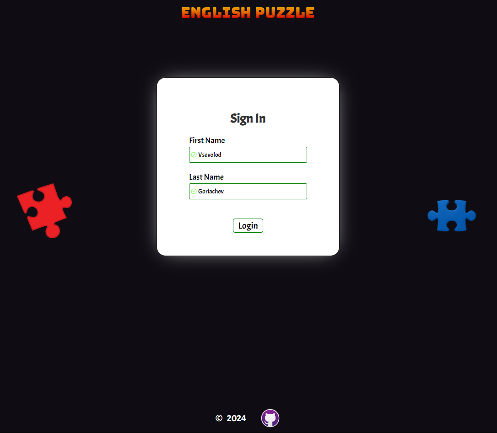
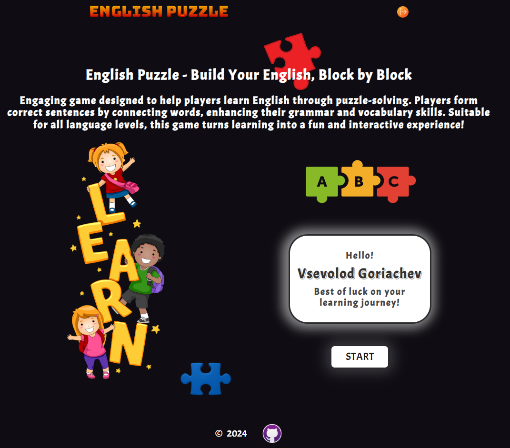
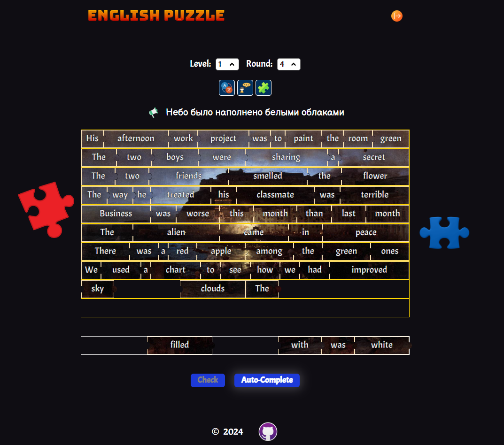
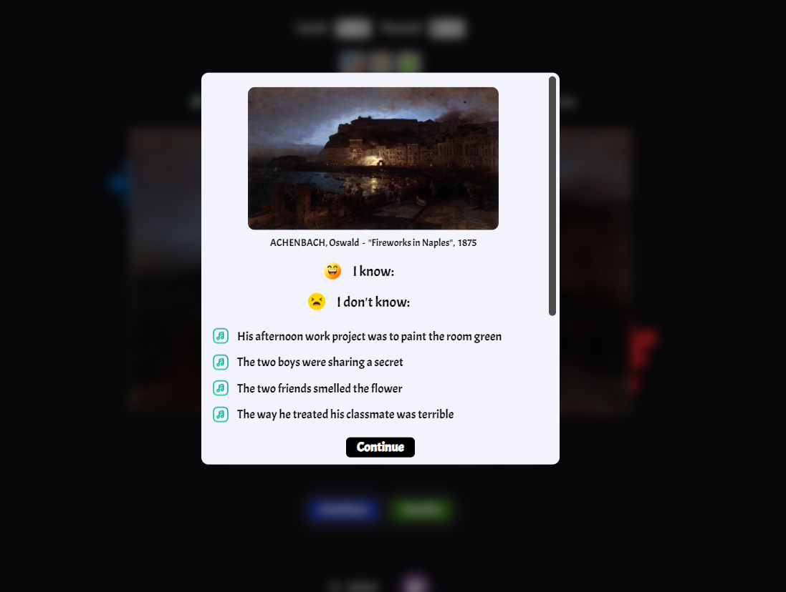

# ENGLISH PUZZLE   
## Deploy - [Link](https://kevaniy0.github.io/english-puzzle/)
### Stack: 

* **TS**
* **SCSS**
* **Webpack**
* **Eslint**, **Prettier**
* **SPA**, **OOP**, **LocalStorage**, **Drag&Drop**
---
### Application Functionality:
1. **LogIn / LogOut** - Personal access to game
2. **Start Page** - User's greeting and additional information
3. **Game Page** - The player is given the opportunity to collect puzzle using clicks and drag&drop, user can return items or swap them
4. **Hints** - 3 hints are provided: translation, listening original sentence and background of the puzzle. The player can turn them on and off at any time
5. **Level and Round** - Ability to change the difficulty level and round
6. **Statistic Page** - After a successful round, player can view all statistics
7. **Settings** - All settings are saved in the local storage

### Preview:

